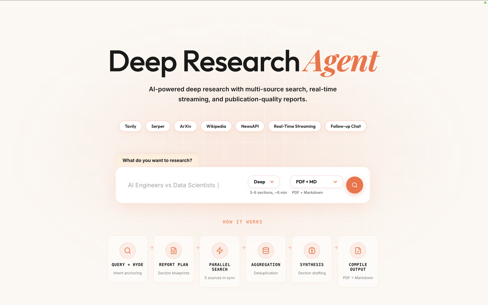

# Deep Research Agent

A fully autonomous, multi-source research agent that generates publication-quality reports on any topic. Built on LangGraph for stateful orchestration, it combines five adaptive search providers, a three-tier LLM hierarchy, and multi-format output compilation into a single optimised end-to-end pipeline. A React frontend streams real-time progress via Server-Sent Events and provides follow-up chat over the generated report.



---

## Table of Contents

1. [Architecture Overview](#architecture-overview)
2. [Pipeline Walkthrough](#pipeline-walkthrough)
3. [Performance Optimisations](#performance-optimisations)
4. [Project Structure](#project-structure)
5. [Backend Modules](#backend-modules)
6. [Frontend](#frontend)
7. [LLM Model Hierarchy](#llm-model-hierarchy)
8. [Search Providers](#search-providers)
9. [Caching](#caching)
10. [Follow-up Chat (RAG)](#follow-up-chat-rag)
11. [Output Formats](#output-formats)
12. [Cost Tracking](#cost-tracking)
13. [Observability (LangSmith)](#observability-langsmith)
14. [Test Suite](#test-suite)
15. [Setup and Installation](#setup-and-installation)
16. [Environment Variables](#environment-variables)
17. [Running the Application](#running-the-application)
18. [API Endpoints](#api-endpoints)
19. [Technologies Used](#technologies-used)
20. [Deployment Guide](#deployment-guide)

---

## Architecture Overview

### Main Reporter Agent (v2.0)

```
START
  |
  v
query_analyzer_hyde          ← Fused query analysis + HyDE anchor + cache check
  |                            Pre-computes HyDE embedding (reused by all sections)
  |--- [cache hit] ──────────> output_compiler ──> END
  |
  |--- [cache miss]
  v
generate_report_plan         ← Parallel planning search (Tavily + Serper)
  |
  v
[INTERRUPT]                  ← Human-in-the-Loop: Plan Review & Editing
  |
  |  Send() fan-out (one per section)
  v
section_builder_with_web_search  (parallel, N sections simultaneously)
  |
  v
aggregator_deduplicator
  |
  v
final_synthesis_writer       ← Editor-in-Chief Model (Claude Sonnet)
  |
  v
output_compiler              ← PDF in thread pool, ChromaDB in background
  |
  v
END
```

### Section Builder Subagent (Deep Extraction)

```
START
  |
  v
query_rewriter_expander      ← Generates exactly 3 categorical queries
  |                            (Technical, Industry, Trends)
  v
multi_source_search          ← Adaptive routing: selects providers per query
  |                            Concurrency limited via Semaphore(4)
  v
result_merger_ranker         ← Selective Deep Extraction (Jina Reader)
  |                            Full context for Top 2 ranked sources
  v
write_section                ← Mid-tier LLM drafts the section (250–300 words)
  |
  v
END
```

---

## Pipeline Walkthrough

### Stage 1 — Query Analysis & Cache Check (`query_analyzer_hyde`)

The entry point of every run:
1. Embeds the incoming topic and checks Redis for a semantically similar previous result (cosine similarity ≥ 0.90).
2. If **cache hit**: short-circuits to `output_compiler` — report returned in seconds with a "Retrieved from Cache" badge.
3. If **cache miss**: uses the mid-tier LLM to perform fused query analysis + HyDE (Hypothetical Document Embedding) generation. The HyDE serves as a dense search anchor.
4. **Pre-computes the HyDE embedding vector** once and stores it in state for reuse by all sections, saving N API calls.

### Stage 2 — Report Planning & HITL (`generate_report_plan`)

Uses the cheap LLM to generate 3 planning queries, then fires them in parallel. The results are ranked and fed to plan a multi-section report (5-6 sections for `deep`).
- **Interrupt Point**: The graph pauses after planning. The plan is sent to the frontend where the user can edit section names, descriptions, or add/remove sections before the intensive research phase begins.

### Stage 3 — Parallel Section Building (`section_builder_with_web_search`)

All research sections are built **simultaneously** via LangGraph's `Send()` fan-out. Each section subagent runs:
- **`query_rewriter_expander`**: Generates **exactly 3 queries** focusing on Technical architecture, Industry use cases, and Recent news.
- **`multi_source_search`**: Routes queries to relevant providers. Uses a `asyncio.Semaphore(4)` to prevent rate-limiting (429s) on academic APIs.
- **`result_merger_ranker`**: Deduplicates and ranks results. Crucially, it performs **Selective Deep Extraction** using the **Jina Reader API** to fetch full Markdown content for the Top 2 ranked sources per section.
- **`write_section`**: Mid-tier LLM drafts a focused section using both snippets and full extracted context.

### Stage 4 — Aggregation & Final Synthesis

- **`aggregator_deduplicator`**: Collects sections and deduplicates sources across the entire report.
- **`final_synthesis_writer`**: The single premium LLM call (Claude Sonnet). Acts as an **Editor-in-Chief** with authority to restructure, bridge narrative gaps, and aggressively deduplicate facts cross-sectionally.

### Stage 5 — Output Compilation (`output_compiler`)

- **PDF generation** runs in a thread pool (WeasyPrint).
- **ChromaDB embedding** runs as a background task for immediate UI response.
- **Redis Cache** stores the result for future semantic hits.

---

## Performance Optimisations

| Optimisation | Files Changed | Impact |
| :--- | :--- | :--- |
| **HITL Planning** | `graph.py`, `main.py` | Saves tokens and ensures report relevance via user review |
| **Selective Deep Extraction** | `nodes.py`, `jina.py` | High-fidelity data for top sources without memory bloat |
| **Categorical Query Cap** | `prompts.py`, `nodes.py` | Cuts per-report cost by ~80% by limiting queries to 3/section |
| **Concurrency Semaphore** | `nodes.py` | Prevents HTTP 429 rate-limiting on ArXiv and other providers |
| **Global HyDE Embedding** | `nodes.py`, `merger.py` | Eliminates N redundant embedding calls across sub-agents |
| **Background ChromaDB** | `output_compiler.py` | Decouples vector indexing from the response stream |
| **Memory Management** | `main.py`, `nodes.py` | Aggressive `gc.collect()` and snippet capping (30 results/section) |

---

## Project Structure

```
deep_research_agent/
|
|-- backend/
|   |-- app/
|   |   |-- main.py               # FastAPI app, SSE management, HITL Resume endpoint
|   |   |-- graph.py              # LangGraph orchestration with Interrupts
|   |   |-- nodes.py              # Node logic (HyDE, Plan, Search, Jina, Synthesis)
|   |   |-- state.py              # Pydantic models (Section, Queries) and State schemas
|   |   |-- prompts.py            # Tiered prompts (Editor-in-Chief, Search Router)
|   |   |-- models.py             # 3-tier LLM factory (Gemini, Haiku, Sonnet)
|   |   |-- sse.py                # SSE manager for real-time progress events
|   |   |-- embeddings.py         # Embedding utility with batching support
|   |   |-- cost_tracker.py       # Per-tier token usage and cost estimation
|   |   |-- output_compiler.py    # Multi-format compiler (PDF, MD, JSON)
|   |   |-- search/
|   |   |   |-- jina.py           # Jina Reader API integration
|   |   |   |-- tavily_search.py  # Tavily (curated web snippets)
|   |   |   |-- merger.py         # Semantic ranking and deduplication
|   |   |-- cache/
|   |   |   |-- redis_cache.py    # Upstash Redis semantic cache (0.90 similarity)
|   |   |-- chat/
|   |       |-- followup.py       # ChromaDB RAG for follow-up chat
|
|-- frontend/
|   |-- src/
|   |   |-- App.jsx               # Main UI, SSE handler, Plan Reviewer, Chat Panel
|   |   |-- App.css               # Premium styling (glassmorphism, animations)
```

---

## Backend Modules

### `main.py` — FastAPI Application
Manages the SSE event stream and HITL state. 
- `POST /api/research`: Starts the session. If it hits the interrupt, returns a `PLAN_REVIEW_REQUIRED` event.
- `POST /api/research/resume/{thread_id}`: Resumes the graph with the user's updated plan.
- **Dynamic Suggestion Chips**: Generates 10 potential follow-up questions using the cheap LLM and randomly samples 3 for the UI.

### `graph.py` — LangGraph Definition
Defines the main `ReportState` graph and the nested `SectionState` subagent. Uses `MemorySaver` for checkpointing, allowing execution to be paused and resumed across HTTP requests.

### `nodes.py` — Core Logic
Implements all graph nodes. Features `_rate_limited_search` to wrap provider calls in a semaphore, ensuring stability across large parallel runs.

### `output_compiler.py` — Multi-Format Compiler
Handles the terminal node logic. It generates a safe filename from the topic, renders the PDF, builds the structured JSON, and kicks off background vector indexing.

---

## LLM Model Hierarchy

| Tier | Default Model | Purpose |
| :--- | :--- | :--- |
| **Cheap** | Gemini Flash 2.0 | Planning, routing, HyDE analysis, suggestion chips |
| **Mid** | Claude Haiku 3.5 | HyDE generation, section drafting, RAG chat |
| **Premium** | Claude Sonnet 3.5 | Final synthesis (Editor-in-Chief) |

---

## Search Providers

| Provider | Purpose |
| :--- | :--- |
| **Jina Reader** | Deep extraction (Full Markdown) from top sources |
| **Tavily** | Broad web search (curated snippets) |
| **Serper** | Google search fallback and planning |
| **ArXiv** | Academic/Scientific paper retrieval |
| **Wikipedia** | Foundational facts and overviews |
| **NewsAPI** | Recent events and industry updates |

---

## Caching & RAG

### Semantic Cache (Redis)
- Uses `text-embedding-3-small` to embed topics.
- Cosine similarity threshold of **0.90** for hits.
- Caches the full Markdown content, JSON data, and suggestion chips.

### Follow-up Chat (ChromaDB)
- Report is chunked by headers and embedded on the fly.
- Question-context matching allows for grounded Q&A.
- Response provides relevant source snippets for verification.

---

## Setup and Installation

### Prerequisites
- Python 3.11+
- Node.js 20+
- Upstash Redis (or local Redis)

### Installation
1. **Backend**:
   ```bash
   cd backend
   python -m venv .venv && source .venv/bin/activate
   pip install -r requirements.txt
   ```
2. **Frontend**:
   ```bash
   cd frontend
   npm install
   ```

### Execution
```bash
# Full launch with tests
./run_app.sh
```

### Docker (Backend Only)
```bash
cd backend
docker build -t deep-research-backend .
docker run -p 8000:8000 --env-file .env deep-research-backend
```

---

## API Endpoints

| Method | Path | Description |
| :--- | :--- | :--- |
| `POST` | `/api/research` | Start research (SSE stream) |
| `POST` | `/api/research/resume/{tid}` | Resume graph after plan approval |
| `POST` | `/api/chat/{id}` | Ask follow-up question (RAG) |
| `GET` | `/api/reports/{id}/json` | Structured JSON output |
| `GET` | `/api/reports/{id}/md` | Raw Markdown output |
| `GET` | `/api/reports/{filename}` | Download PDF/MD files |

---

## Technologies Used

- **LangGraph**: Orchestration and HITL management.
- **FastAPI**: Backend API and SSE streaming.
- **React 19**: Modern frontend with real-time feedback.
- **WeasyPrint**: PDF generation.
- **ChromaDB**: Local vector storage.
- **Upstash Redis**: Serverless semantic caching.
- **OpenRouter**: Unified LLM access.
